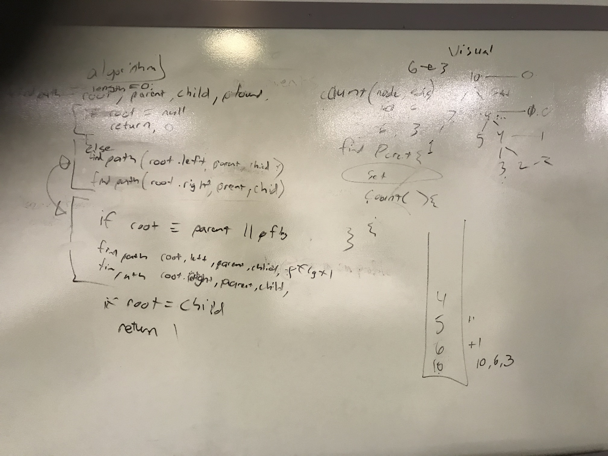
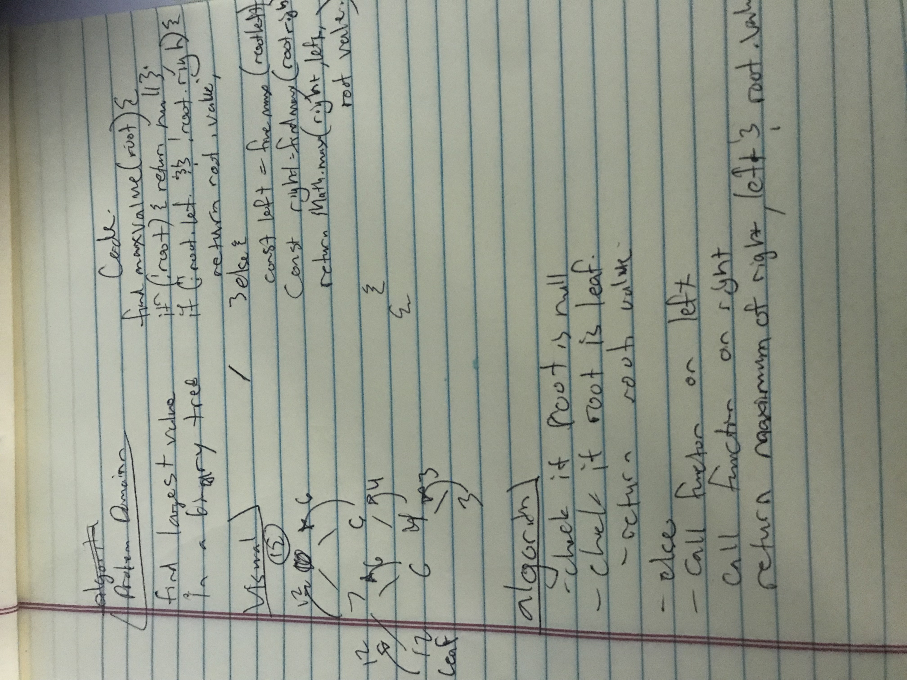

# data-structures-and-algorithms

# binary tree
this is a tree class with a function that finds the path length between two nodes

## Challenge
function that finds the path length between two nodes

## Approach & Efficiency
travers the tree top down and if you find the parent start passing a true flag.
if you find the child return a +1

## White Boarding Solution

