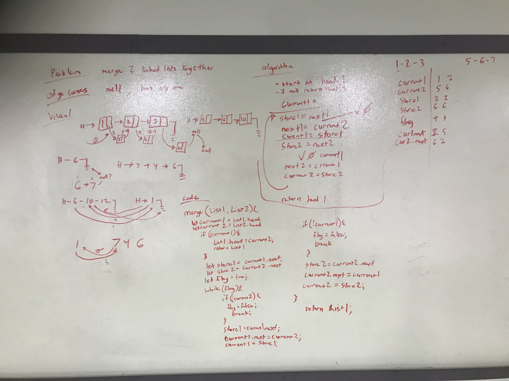
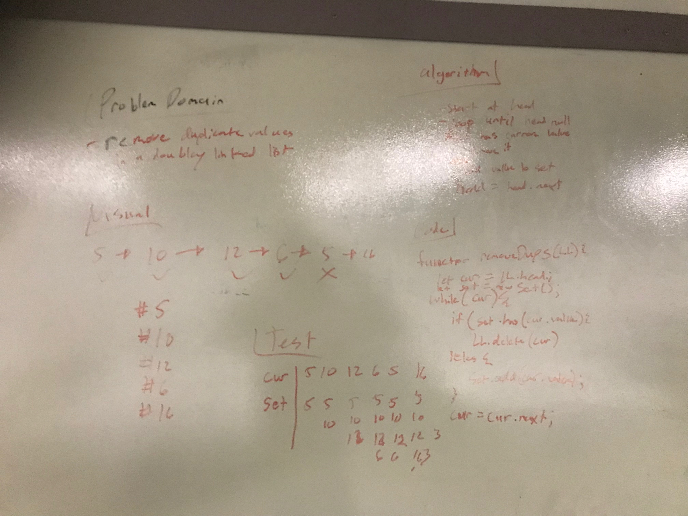

# data-structures-and-algorithms

# Linked List
this function called mergeLists takes two linked lists as arguments. It combines them into one list alternating every other one.

## Challenge
merge to lists together alternating every other node into one list

## Approach & Efficiency
I stored the next value from the other list as i reset the value of the current list

## White Boarding Solution

# Data-Structures
