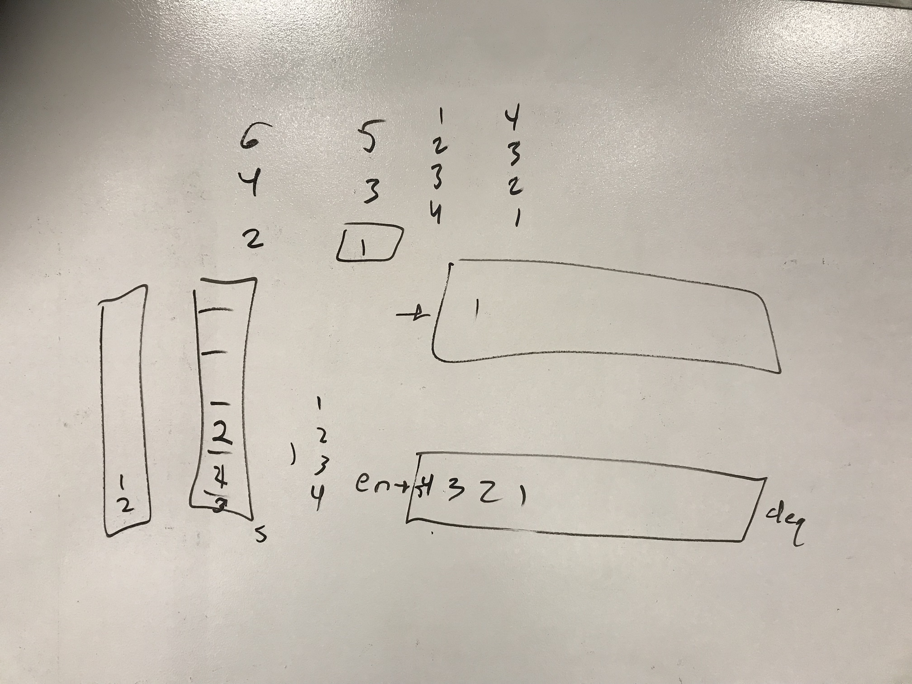

# data-structures-and-algorithms

# Queue with Stacks
this is a seudo class that creates a queue by using 2 stacks under the hood.

## Challenge
create enqueue and dequeue methods

## Approach & Efficiency
i used 2 stacks under the hood

## White Boarding Solution

