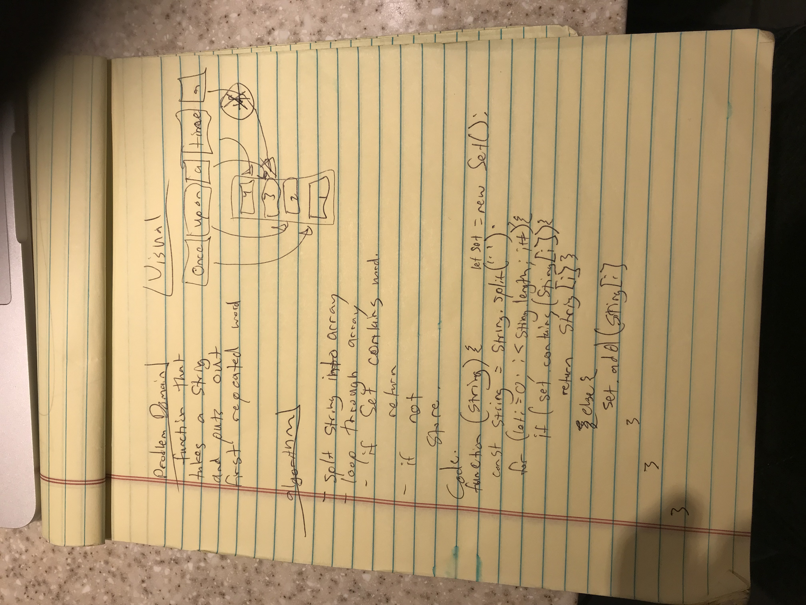

# data-structures-and-algorithms

# Repeated words
this is a function that returns first word repeated in sentence.

## Challenge
used a Set to store hashed words and if set already contained it returned it

## Approach & Efficiency
used a Set to store hashed words and if set already contained it returned it

## White Boarding Solution

