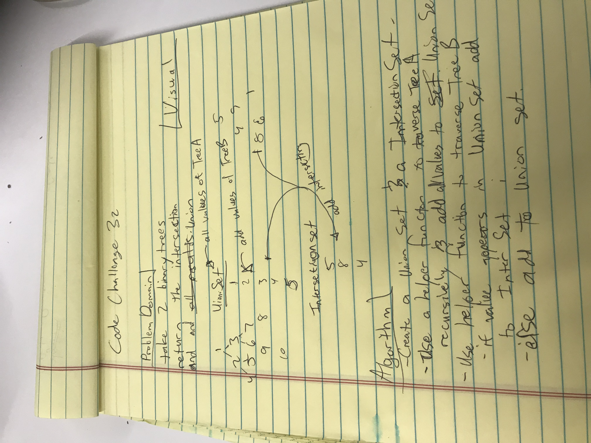
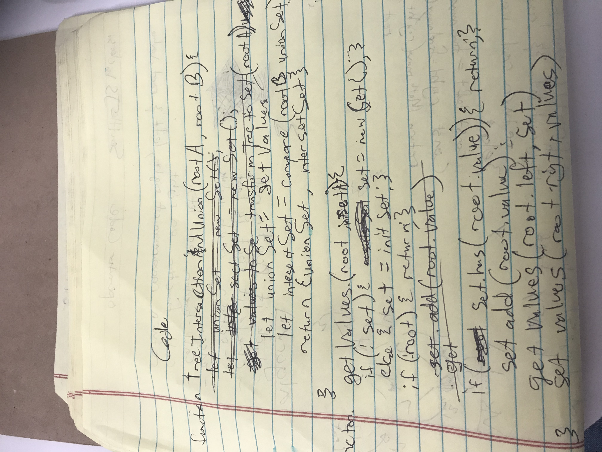

# data-structures-and-algorithms

# treeItersection

## Challenge
create a function that takes in the root of 2 binary trees and finds all the insecting and

## Approach & Efficiency
Use 2 Sets and 2 helper functions.
traverse the first tree recursively and store the values. 
traverse the second tree and compare the values.
store them in set 1 or 2 depending on if they exist in set 1 already

## White Boarding Solution

